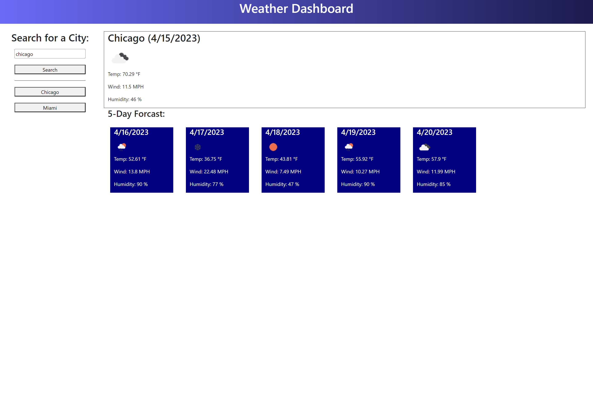

# weather-forecast

## Descripion

This project can show the user the weather in a city that they search for. The webpage shows the current weather and a 5 day forecast. 

## technologys

The webpage uses HTML, CSS, dayjs, bootstrap, and JavaScript

## learned

I learned how to make information from an API usable to code this webpage.

## Task

GIVEN a weather dashboard with form inputs
WHEN I search for a city
THEN I am presented with current and future conditions for that city and that city is added to the search history
WHEN I view current weather conditions for that city
THEN I am presented with the city name, the date, an icon representation of weather conditions, the temperature, the humidity, and the wind speed
WHEN I view future weather conditions for that city
THEN I am presented with a 5-day forecast that displays the date, an icon representation of weather conditions, the temperature, the wind speed, and the humidity
WHEN I click on a city in the search history
THEN I am again presented with current and future conditions for that city

## Usage

Type in any city the user wants the weather for. Once the user clicks search the web page will update and display the current weather and a 5 day forecast. The searched city will then show up in the recently searched menu. The user can click on them to change the displayed weather to switch to the weather for that city.

## Webpage
https://hayessea000.github.io/weather-forecast/
